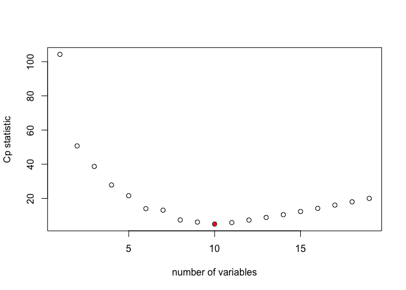
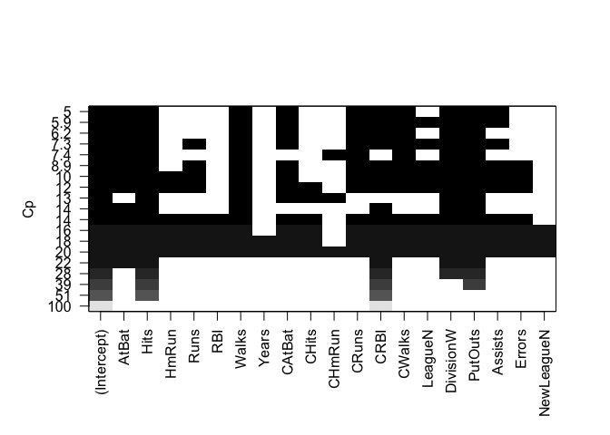

best\_subset\_selection
================

This is an [R Markdown](http://rmarkdown.rstudio.com) Notebook. When you execute code within the notebook, the results appear beneath the code.

Try executing this chunk by clicking the *Run* button within the chunk or by placing your cursor inside it and pressing *Cmd+Shift+Enter*.

``` r
# model selection
library(ISLR)
summary(Hitters)
```

    ##      AtBat            Hits         HmRun            Runs       
    ##  Min.   : 16.0   Min.   :  1   Min.   : 0.00   Min.   :  0.00  
    ##  1st Qu.:255.2   1st Qu.: 64   1st Qu.: 4.00   1st Qu.: 30.25  
    ##  Median :379.5   Median : 96   Median : 8.00   Median : 48.00  
    ##  Mean   :380.9   Mean   :101   Mean   :10.77   Mean   : 50.91  
    ##  3rd Qu.:512.0   3rd Qu.:137   3rd Qu.:16.00   3rd Qu.: 69.00  
    ##  Max.   :687.0   Max.   :238   Max.   :40.00   Max.   :130.00  
    ##                                                                
    ##       RBI             Walks            Years            CAtBat       
    ##  Min.   :  0.00   Min.   :  0.00   Min.   : 1.000   Min.   :   19.0  
    ##  1st Qu.: 28.00   1st Qu.: 22.00   1st Qu.: 4.000   1st Qu.:  816.8  
    ##  Median : 44.00   Median : 35.00   Median : 6.000   Median : 1928.0  
    ##  Mean   : 48.03   Mean   : 38.74   Mean   : 7.444   Mean   : 2648.7  
    ##  3rd Qu.: 64.75   3rd Qu.: 53.00   3rd Qu.:11.000   3rd Qu.: 3924.2  
    ##  Max.   :121.00   Max.   :105.00   Max.   :24.000   Max.   :14053.0  
    ##                                                                      
    ##      CHits            CHmRun           CRuns             CRBI        
    ##  Min.   :   4.0   Min.   :  0.00   Min.   :   1.0   Min.   :   0.00  
    ##  1st Qu.: 209.0   1st Qu.: 14.00   1st Qu.: 100.2   1st Qu.:  88.75  
    ##  Median : 508.0   Median : 37.50   Median : 247.0   Median : 220.50  
    ##  Mean   : 717.6   Mean   : 69.49   Mean   : 358.8   Mean   : 330.12  
    ##  3rd Qu.:1059.2   3rd Qu.: 90.00   3rd Qu.: 526.2   3rd Qu.: 426.25  
    ##  Max.   :4256.0   Max.   :548.00   Max.   :2165.0   Max.   :1659.00  
    ##                                                                      
    ##      CWalks        League  Division    PutOuts          Assists     
    ##  Min.   :   0.00   A:175   E:157    Min.   :   0.0   Min.   :  0.0  
    ##  1st Qu.:  67.25   N:147   W:165    1st Qu.: 109.2   1st Qu.:  7.0  
    ##  Median : 170.50                    Median : 212.0   Median : 39.5  
    ##  Mean   : 260.24                    Mean   : 288.9   Mean   :106.9  
    ##  3rd Qu.: 339.25                    3rd Qu.: 325.0   3rd Qu.:166.0  
    ##  Max.   :1566.00                    Max.   :1378.0   Max.   :492.0  
    ##                                                                     
    ##      Errors          Salary       NewLeague
    ##  Min.   : 0.00   Min.   :  67.5   A:176    
    ##  1st Qu.: 3.00   1st Qu.: 190.0   N:146    
    ##  Median : 6.00   Median : 425.0            
    ##  Mean   : 8.04   Mean   : 535.9            
    ##  3rd Qu.:11.00   3rd Qu.: 750.0            
    ##  Max.   :32.00   Max.   :2460.0            
    ##                  NA's   :59

``` r
# omitting na values
Hitters=na.omit(Hitters)
# checking if all na's have been removed
with(Hitters,sum(is.na(Salary)))
```

    ## [1] 0

``` r
# best subset regression
library(leaps)
model=regsubsets(Salary~.,data=Hitters)
summary(model)
```

    ## Subset selection object
    ## Call: regsubsets.formula(Salary ~ ., data = Hitters)
    ## 19 Variables  (and intercept)
    ##            Forced in Forced out
    ## AtBat          FALSE      FALSE
    ## Hits           FALSE      FALSE
    ## HmRun          FALSE      FALSE
    ## Runs           FALSE      FALSE
    ## RBI            FALSE      FALSE
    ## Walks          FALSE      FALSE
    ## Years          FALSE      FALSE
    ## CAtBat         FALSE      FALSE
    ## CHits          FALSE      FALSE
    ## CHmRun         FALSE      FALSE
    ## CRuns          FALSE      FALSE
    ## CRBI           FALSE      FALSE
    ## CWalks         FALSE      FALSE
    ## LeagueN        FALSE      FALSE
    ## DivisionW      FALSE      FALSE
    ## PutOuts        FALSE      FALSE
    ## Assists        FALSE      FALSE
    ## Errors         FALSE      FALSE
    ## NewLeagueN     FALSE      FALSE
    ## 1 subsets of each size up to 8
    ## Selection Algorithm: exhaustive
    ##          AtBat Hits HmRun Runs RBI Walks Years CAtBat CHits CHmRun CRuns
    ## 1  ( 1 ) " "   " "  " "   " "  " " " "   " "   " "    " "   " "    " "  
    ## 2  ( 1 ) " "   "*"  " "   " "  " " " "   " "   " "    " "   " "    " "  
    ## 3  ( 1 ) " "   "*"  " "   " "  " " " "   " "   " "    " "   " "    " "  
    ## 4  ( 1 ) " "   "*"  " "   " "  " " " "   " "   " "    " "   " "    " "  
    ## 5  ( 1 ) "*"   "*"  " "   " "  " " " "   " "   " "    " "   " "    " "  
    ## 6  ( 1 ) "*"   "*"  " "   " "  " " "*"   " "   " "    " "   " "    " "  
    ## 7  ( 1 ) " "   "*"  " "   " "  " " "*"   " "   "*"    "*"   "*"    " "  
    ## 8  ( 1 ) "*"   "*"  " "   " "  " " "*"   " "   " "    " "   "*"    "*"  
    ##          CRBI CWalks LeagueN DivisionW PutOuts Assists Errors NewLeagueN
    ## 1  ( 1 ) "*"  " "    " "     " "       " "     " "     " "    " "       
    ## 2  ( 1 ) "*"  " "    " "     " "       " "     " "     " "    " "       
    ## 3  ( 1 ) "*"  " "    " "     " "       "*"     " "     " "    " "       
    ## 4  ( 1 ) "*"  " "    " "     "*"       "*"     " "     " "    " "       
    ## 5  ( 1 ) "*"  " "    " "     "*"       "*"     " "     " "    " "       
    ## 6  ( 1 ) "*"  " "    " "     "*"       "*"     " "     " "    " "       
    ## 7  ( 1 ) " "  " "    " "     "*"       "*"     " "     " "    " "       
    ## 8  ( 1 ) " "  "*"    " "     "*"       "*"     " "     " "    " "

``` r
# by default it only goes to subset of size 8.
# but we have 19 variables

model19=regsubsets(Salary~.,data=Hitters,nvmax=19)
summary(model19)
```

    ## Subset selection object
    ## Call: regsubsets.formula(Salary ~ ., data = Hitters, nvmax = 19)
    ## 19 Variables  (and intercept)
    ##            Forced in Forced out
    ## AtBat          FALSE      FALSE
    ## Hits           FALSE      FALSE
    ## HmRun          FALSE      FALSE
    ## Runs           FALSE      FALSE
    ## RBI            FALSE      FALSE
    ## Walks          FALSE      FALSE
    ## Years          FALSE      FALSE
    ## CAtBat         FALSE      FALSE
    ## CHits          FALSE      FALSE
    ## CHmRun         FALSE      FALSE
    ## CRuns          FALSE      FALSE
    ## CRBI           FALSE      FALSE
    ## CWalks         FALSE      FALSE
    ## LeagueN        FALSE      FALSE
    ## DivisionW      FALSE      FALSE
    ## PutOuts        FALSE      FALSE
    ## Assists        FALSE      FALSE
    ## Errors         FALSE      FALSE
    ## NewLeagueN     FALSE      FALSE
    ## 1 subsets of each size up to 19
    ## Selection Algorithm: exhaustive
    ##           AtBat Hits HmRun Runs RBI Walks Years CAtBat CHits CHmRun CRuns
    ## 1  ( 1 )  " "   " "  " "   " "  " " " "   " "   " "    " "   " "    " "  
    ## 2  ( 1 )  " "   "*"  " "   " "  " " " "   " "   " "    " "   " "    " "  
    ## 3  ( 1 )  " "   "*"  " "   " "  " " " "   " "   " "    " "   " "    " "  
    ## 4  ( 1 )  " "   "*"  " "   " "  " " " "   " "   " "    " "   " "    " "  
    ## 5  ( 1 )  "*"   "*"  " "   " "  " " " "   " "   " "    " "   " "    " "  
    ## 6  ( 1 )  "*"   "*"  " "   " "  " " "*"   " "   " "    " "   " "    " "  
    ## 7  ( 1 )  " "   "*"  " "   " "  " " "*"   " "   "*"    "*"   "*"    " "  
    ## 8  ( 1 )  "*"   "*"  " "   " "  " " "*"   " "   " "    " "   "*"    "*"  
    ## 9  ( 1 )  "*"   "*"  " "   " "  " " "*"   " "   "*"    " "   " "    "*"  
    ## 10  ( 1 ) "*"   "*"  " "   " "  " " "*"   " "   "*"    " "   " "    "*"  
    ## 11  ( 1 ) "*"   "*"  " "   " "  " " "*"   " "   "*"    " "   " "    "*"  
    ## 12  ( 1 ) "*"   "*"  " "   "*"  " " "*"   " "   "*"    " "   " "    "*"  
    ## 13  ( 1 ) "*"   "*"  " "   "*"  " " "*"   " "   "*"    " "   " "    "*"  
    ## 14  ( 1 ) "*"   "*"  "*"   "*"  " " "*"   " "   "*"    " "   " "    "*"  
    ## 15  ( 1 ) "*"   "*"  "*"   "*"  " " "*"   " "   "*"    "*"   " "    "*"  
    ## 16  ( 1 ) "*"   "*"  "*"   "*"  "*" "*"   " "   "*"    "*"   " "    "*"  
    ## 17  ( 1 ) "*"   "*"  "*"   "*"  "*" "*"   " "   "*"    "*"   " "    "*"  
    ## 18  ( 1 ) "*"   "*"  "*"   "*"  "*" "*"   "*"   "*"    "*"   " "    "*"  
    ## 19  ( 1 ) "*"   "*"  "*"   "*"  "*" "*"   "*"   "*"    "*"   "*"    "*"  
    ##           CRBI CWalks LeagueN DivisionW PutOuts Assists Errors NewLeagueN
    ## 1  ( 1 )  "*"  " "    " "     " "       " "     " "     " "    " "       
    ## 2  ( 1 )  "*"  " "    " "     " "       " "     " "     " "    " "       
    ## 3  ( 1 )  "*"  " "    " "     " "       "*"     " "     " "    " "       
    ## 4  ( 1 )  "*"  " "    " "     "*"       "*"     " "     " "    " "       
    ## 5  ( 1 )  "*"  " "    " "     "*"       "*"     " "     " "    " "       
    ## 6  ( 1 )  "*"  " "    " "     "*"       "*"     " "     " "    " "       
    ## 7  ( 1 )  " "  " "    " "     "*"       "*"     " "     " "    " "       
    ## 8  ( 1 )  " "  "*"    " "     "*"       "*"     " "     " "    " "       
    ## 9  ( 1 )  "*"  "*"    " "     "*"       "*"     " "     " "    " "       
    ## 10  ( 1 ) "*"  "*"    " "     "*"       "*"     "*"     " "    " "       
    ## 11  ( 1 ) "*"  "*"    "*"     "*"       "*"     "*"     " "    " "       
    ## 12  ( 1 ) "*"  "*"    "*"     "*"       "*"     "*"     " "    " "       
    ## 13  ( 1 ) "*"  "*"    "*"     "*"       "*"     "*"     "*"    " "       
    ## 14  ( 1 ) "*"  "*"    "*"     "*"       "*"     "*"     "*"    " "       
    ## 15  ( 1 ) "*"  "*"    "*"     "*"       "*"     "*"     "*"    " "       
    ## 16  ( 1 ) "*"  "*"    "*"     "*"       "*"     "*"     "*"    " "       
    ## 17  ( 1 ) "*"  "*"    "*"     "*"       "*"     "*"     "*"    "*"       
    ## 18  ( 1 ) "*"  "*"    "*"     "*"       "*"     "*"     "*"    "*"       
    ## 19  ( 1 ) "*"  "*"    "*"     "*"       "*"     "*"     "*"    "*"

``` r
names(summary(model19))
```

    ## [1] "which"  "rsq"    "rss"    "adjr2"  "cp"     "bic"    "outmat" "obj"

``` r
# plotting
plot(summary(model19)$cp,xlab="number of variables",yla ="Cp statistic")
# using model with lowest Cp
which.min(summary(model19)$cp)
```

    ## [1] 10

``` r
points(10,summary(model19)$cp[10],pch=20,col="red")
```



``` r
# plotting all models with Cp
plot(model19,scale="Cp")
```



``` r
coef(model19,10)
```

    ##  (Intercept)        AtBat         Hits        Walks       CAtBat 
    ##  162.5354420   -2.1686501    6.9180175    5.7732246   -0.1300798 
    ##        CRuns         CRBI       CWalks    DivisionW      PutOuts 
    ##    1.4082490    0.7743122   -0.8308264 -112.3800575    0.2973726 
    ##      Assists 
    ##    0.2831680

Add a new chunk by clicking the *Insert Chunk* button on the toolbar or by pressing *Cmd+Option+I*.

When you save the notebook, an HTML file containing the code and output will be saved alongside it (click the *Preview* button or press *Cmd+Shift+K* to preview the HTML file).
