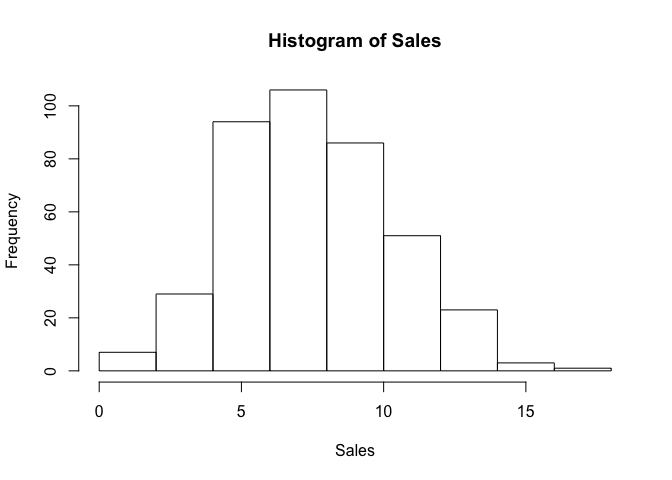
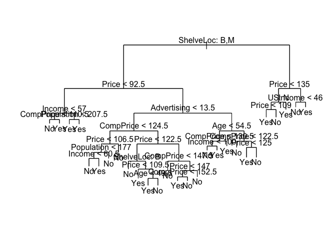
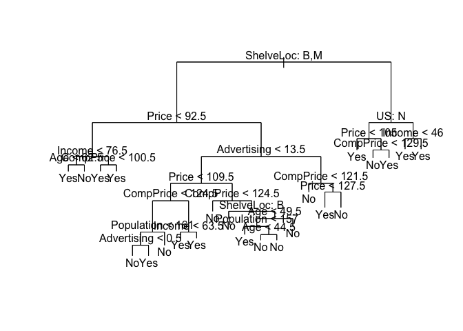
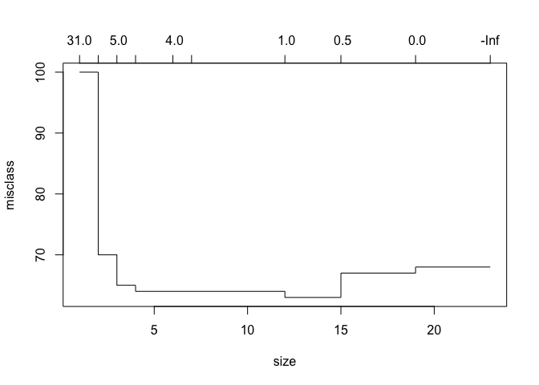
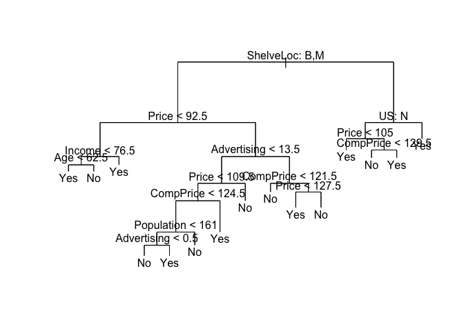

decision\_trees
================

This is an [R Markdown](http://rmarkdown.rstudio.com) Notebook. When you execute code within the notebook, the results appear beneath the code.

Try executing this chunk by clicking the *Run* button within the chunk or by placing your cursor inside it and pressing *Cmd+Shift+Enter*.

``` r
# decision trees
require(ISLR)
```

    ## Loading required package: ISLR

``` r
require(tree)
```

    ## Loading required package: tree

``` r
attach(Carseats)

hist(Sales)
```



``` r
high=ifelse(Sales<=8,"No","Yes")
Carseats=data.frame(Carseats,high)
```

``` r
# model 
model=tree(high~.-Sales,data=Carseats)
summary(model)
```

    ## 
    ## Classification tree:
    ## tree(formula = high ~ . - Sales, data = Carseats)
    ## Variables actually used in tree construction:
    ## [1] "ShelveLoc"   "Price"       "Income"      "CompPrice"   "Population" 
    ## [6] "Advertising" "Age"         "US"         
    ## Number of terminal nodes:  27 
    ## Residual mean deviance:  0.4575 = 170.7 / 373 
    ## Misclassification error rate: 0.09 = 36 / 400

``` r
plot(model)
text(model,pretty=1)
```



``` r
# detailed model
model
```

    ## node), split, n, deviance, yval, (yprob)
    ##       * denotes terminal node
    ## 
    ##   1) root 400 541.500 No ( 0.59000 0.41000 )  
    ##     2) ShelveLoc: Bad,Medium 315 390.600 No ( 0.68889 0.31111 )  
    ##       4) Price < 92.5 46  56.530 Yes ( 0.30435 0.69565 )  
    ##         8) Income < 57 10  12.220 No ( 0.70000 0.30000 )  
    ##          16) CompPrice < 110.5 5   0.000 No ( 1.00000 0.00000 ) *
    ##          17) CompPrice > 110.5 5   6.730 Yes ( 0.40000 0.60000 ) *
    ##         9) Income > 57 36  35.470 Yes ( 0.19444 0.80556 )  
    ##          18) Population < 207.5 16  21.170 Yes ( 0.37500 0.62500 ) *
    ##          19) Population > 207.5 20   7.941 Yes ( 0.05000 0.95000 ) *
    ##       5) Price > 92.5 269 299.800 No ( 0.75465 0.24535 )  
    ##        10) Advertising < 13.5 224 213.200 No ( 0.81696 0.18304 )  
    ##          20) CompPrice < 124.5 96  44.890 No ( 0.93750 0.06250 )  
    ##            40) Price < 106.5 38  33.150 No ( 0.84211 0.15789 )  
    ##              80) Population < 177 12  16.300 No ( 0.58333 0.41667 )  
    ##               160) Income < 60.5 6   0.000 No ( 1.00000 0.00000 ) *
    ##               161) Income > 60.5 6   5.407 Yes ( 0.16667 0.83333 ) *
    ##              81) Population > 177 26   8.477 No ( 0.96154 0.03846 ) *
    ##            41) Price > 106.5 58   0.000 No ( 1.00000 0.00000 ) *
    ##          21) CompPrice > 124.5 128 150.200 No ( 0.72656 0.27344 )  
    ##            42) Price < 122.5 51  70.680 Yes ( 0.49020 0.50980 )  
    ##              84) ShelveLoc: Bad 11   6.702 No ( 0.90909 0.09091 ) *
    ##              85) ShelveLoc: Medium 40  52.930 Yes ( 0.37500 0.62500 )  
    ##               170) Price < 109.5 16   7.481 Yes ( 0.06250 0.93750 ) *
    ##               171) Price > 109.5 24  32.600 No ( 0.58333 0.41667 )  
    ##                 342) Age < 49.5 13  16.050 Yes ( 0.30769 0.69231 ) *
    ##                 343) Age > 49.5 11   6.702 No ( 0.90909 0.09091 ) *
    ##            43) Price > 122.5 77  55.540 No ( 0.88312 0.11688 )  
    ##              86) CompPrice < 147.5 58  17.400 No ( 0.96552 0.03448 ) *
    ##              87) CompPrice > 147.5 19  25.010 No ( 0.63158 0.36842 )  
    ##               174) Price < 147 12  16.300 Yes ( 0.41667 0.58333 )  
    ##                 348) CompPrice < 152.5 7   5.742 Yes ( 0.14286 0.85714 ) *
    ##                 349) CompPrice > 152.5 5   5.004 No ( 0.80000 0.20000 ) *
    ##               175) Price > 147 7   0.000 No ( 1.00000 0.00000 ) *
    ##        11) Advertising > 13.5 45  61.830 Yes ( 0.44444 0.55556 )  
    ##          22) Age < 54.5 25  25.020 Yes ( 0.20000 0.80000 )  
    ##            44) CompPrice < 130.5 14  18.250 Yes ( 0.35714 0.64286 )  
    ##              88) Income < 100 9  12.370 No ( 0.55556 0.44444 ) *
    ##              89) Income > 100 5   0.000 Yes ( 0.00000 1.00000 ) *
    ##            45) CompPrice > 130.5 11   0.000 Yes ( 0.00000 1.00000 ) *
    ##          23) Age > 54.5 20  22.490 No ( 0.75000 0.25000 )  
    ##            46) CompPrice < 122.5 10   0.000 No ( 1.00000 0.00000 ) *
    ##            47) CompPrice > 122.5 10  13.860 No ( 0.50000 0.50000 )  
    ##              94) Price < 125 5   0.000 Yes ( 0.00000 1.00000 ) *
    ##              95) Price > 125 5   0.000 No ( 1.00000 0.00000 ) *
    ##     3) ShelveLoc: Good 85  90.330 Yes ( 0.22353 0.77647 )  
    ##       6) Price < 135 68  49.260 Yes ( 0.11765 0.88235 )  
    ##        12) US: No 17  22.070 Yes ( 0.35294 0.64706 )  
    ##          24) Price < 109 8   0.000 Yes ( 0.00000 1.00000 ) *
    ##          25) Price > 109 9  11.460 No ( 0.66667 0.33333 ) *
    ##        13) US: Yes 51  16.880 Yes ( 0.03922 0.96078 ) *
    ##       7) Price > 135 17  22.070 No ( 0.64706 0.35294 )  
    ##        14) Income < 46 6   0.000 No ( 1.00000 0.00000 ) *
    ##        15) Income > 46 11  15.160 Yes ( 0.45455 0.54545 ) *

``` r
set.seed(10)
train=sample(1:nrow(Carseats),250)
model=tree(high~.-Sales,Carseats,subset=train)
plot(model)
text(model,pretty=1)
```



``` r
# prediction
predictions=predict(model,Carseats[-train,],type="class")
with(Carseats[-train,],table(predictions,high))
```

    ##            high
    ## predictions No Yes
    ##         No  67  17
    ##         Yes 19  47

``` r
#accuracy
(73+43)/150
```

    ## [1] 0.7733333

``` r
# using CV to prune tree
cv.model=cv.tree(model,FUN=prune.misclass)
cv.model
```

    ## $size
    ##  [1] 23 19 15 12  7  6  4  3  2  1
    ## 
    ## $dev
    ##  [1]  68  68  67  63  64  64  64  65  70 100
    ## 
    ## $k
    ##  [1] -Inf  0.0  0.5  1.0  2.0  4.0  4.5  5.0 12.0 31.0
    ## 
    ## $method
    ## [1] "misclass"
    ## 
    ## attr(,"class")
    ## [1] "prune"         "tree.sequence"

``` r
plot(cv.model) # min value is at 8
```



``` r
prune.model=prune.misclass(model,best=13)
plot(prune.model)
text(prune.model,pretty=1)
```



``` r
predictions=predict(prune.model,Carseats[-train,],type="class")
with(Carseats[-train,],table(predictions,high))
```

    ##            high
    ## predictions No Yes
    ##         No  68  21
    ##         Yes 18  43

``` r
#accuracy after pruning
(76+40)/150
```

    ## [1] 0.7733333

Add a new chunk by clicking the *Insert Chunk* button on the toolbar or by pressing *Cmd+Option+I*.

When you save the notebook, an HTML file containing the code and output will be saved alongside it (click the *Preview* button or press *Cmd+Shift+K* to preview the HTML file).
