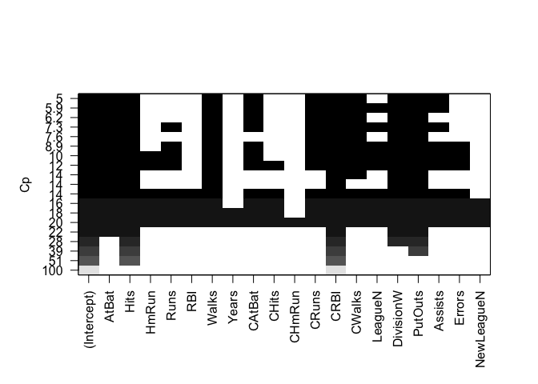
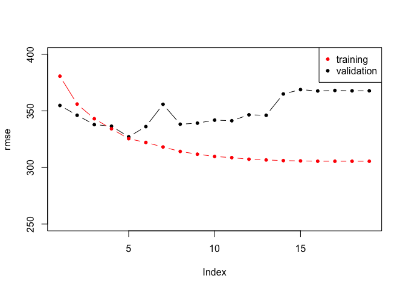
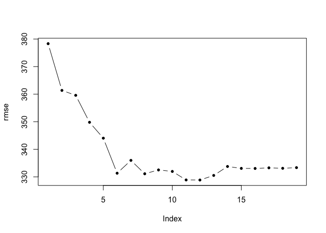

fwd\_selection\_cv
================

This is an [R Markdown](http://rmarkdown.rstudio.com) Notebook. When you execute code within the notebook, the results appear beneath the code.

Try executing this chunk by clicking the *Run* button within the chunk or by placing your cursor inside it and pressing *Cmd+Shift+Enter*.

``` r
# forward subset selection

# model selection
library(ISLR)
library(leaps)
summary(Hitters)
```

    ##      AtBat            Hits         HmRun            Runs       
    ##  Min.   : 16.0   Min.   :  1   Min.   : 0.00   Min.   :  0.00  
    ##  1st Qu.:255.2   1st Qu.: 64   1st Qu.: 4.00   1st Qu.: 30.25  
    ##  Median :379.5   Median : 96   Median : 8.00   Median : 48.00  
    ##  Mean   :380.9   Mean   :101   Mean   :10.77   Mean   : 50.91  
    ##  3rd Qu.:512.0   3rd Qu.:137   3rd Qu.:16.00   3rd Qu.: 69.00  
    ##  Max.   :687.0   Max.   :238   Max.   :40.00   Max.   :130.00  
    ##                                                                
    ##       RBI             Walks            Years            CAtBat       
    ##  Min.   :  0.00   Min.   :  0.00   Min.   : 1.000   Min.   :   19.0  
    ##  1st Qu.: 28.00   1st Qu.: 22.00   1st Qu.: 4.000   1st Qu.:  816.8  
    ##  Median : 44.00   Median : 35.00   Median : 6.000   Median : 1928.0  
    ##  Mean   : 48.03   Mean   : 38.74   Mean   : 7.444   Mean   : 2648.7  
    ##  3rd Qu.: 64.75   3rd Qu.: 53.00   3rd Qu.:11.000   3rd Qu.: 3924.2  
    ##  Max.   :121.00   Max.   :105.00   Max.   :24.000   Max.   :14053.0  
    ##                                                                      
    ##      CHits            CHmRun           CRuns             CRBI        
    ##  Min.   :   4.0   Min.   :  0.00   Min.   :   1.0   Min.   :   0.00  
    ##  1st Qu.: 209.0   1st Qu.: 14.00   1st Qu.: 100.2   1st Qu.:  88.75  
    ##  Median : 508.0   Median : 37.50   Median : 247.0   Median : 220.50  
    ##  Mean   : 717.6   Mean   : 69.49   Mean   : 358.8   Mean   : 330.12  
    ##  3rd Qu.:1059.2   3rd Qu.: 90.00   3rd Qu.: 526.2   3rd Qu.: 426.25  
    ##  Max.   :4256.0   Max.   :548.00   Max.   :2165.0   Max.   :1659.00  
    ##                                                                      
    ##      CWalks        League  Division    PutOuts          Assists     
    ##  Min.   :   0.00   A:175   E:157    Min.   :   0.0   Min.   :  0.0  
    ##  1st Qu.:  67.25   N:147   W:165    1st Qu.: 109.2   1st Qu.:  7.0  
    ##  Median : 170.50                    Median : 212.0   Median : 39.5  
    ##  Mean   : 260.24                    Mean   : 288.9   Mean   :106.9  
    ##  3rd Qu.: 339.25                    3rd Qu.: 325.0   3rd Qu.:166.0  
    ##  Max.   :1566.00                    Max.   :1378.0   Max.   :492.0  
    ##                                                                     
    ##      Errors          Salary       NewLeague
    ##  Min.   : 0.00   Min.   :  67.5   A:176    
    ##  1st Qu.: 3.00   1st Qu.: 190.0   N:146    
    ##  Median : 6.00   Median : 425.0            
    ##  Mean   : 8.04   Mean   : 535.9            
    ##  3rd Qu.:11.00   3rd Qu.: 750.0            
    ##  Max.   :32.00   Max.   :2460.0            
    ##                  NA's   :59

``` r
# omitting na values
Hitters=na.omit(Hitters)
# checking if all na's have been removed
with(Hitters,sum(is.na(Salary)))
```

    ## [1] 0

``` r
model=regsubsets(Salary~.,data=Hitters, nvmax=19, method="forward")
summary(model)
```

    ## Subset selection object
    ## Call: regsubsets.formula(Salary ~ ., data = Hitters, nvmax = 19, method = "forward")
    ## 19 Variables  (and intercept)
    ##            Forced in Forced out
    ## AtBat          FALSE      FALSE
    ## Hits           FALSE      FALSE
    ## HmRun          FALSE      FALSE
    ## Runs           FALSE      FALSE
    ## RBI            FALSE      FALSE
    ## Walks          FALSE      FALSE
    ## Years          FALSE      FALSE
    ## CAtBat         FALSE      FALSE
    ## CHits          FALSE      FALSE
    ## CHmRun         FALSE      FALSE
    ## CRuns          FALSE      FALSE
    ## CRBI           FALSE      FALSE
    ## CWalks         FALSE      FALSE
    ## LeagueN        FALSE      FALSE
    ## DivisionW      FALSE      FALSE
    ## PutOuts        FALSE      FALSE
    ## Assists        FALSE      FALSE
    ## Errors         FALSE      FALSE
    ## NewLeagueN     FALSE      FALSE
    ## 1 subsets of each size up to 19
    ## Selection Algorithm: forward
    ##           AtBat Hits HmRun Runs RBI Walks Years CAtBat CHits CHmRun CRuns
    ## 1  ( 1 )  " "   " "  " "   " "  " " " "   " "   " "    " "   " "    " "  
    ## 2  ( 1 )  " "   "*"  " "   " "  " " " "   " "   " "    " "   " "    " "  
    ## 3  ( 1 )  " "   "*"  " "   " "  " " " "   " "   " "    " "   " "    " "  
    ## 4  ( 1 )  " "   "*"  " "   " "  " " " "   " "   " "    " "   " "    " "  
    ## 5  ( 1 )  "*"   "*"  " "   " "  " " " "   " "   " "    " "   " "    " "  
    ## 6  ( 1 )  "*"   "*"  " "   " "  " " "*"   " "   " "    " "   " "    " "  
    ## 7  ( 1 )  "*"   "*"  " "   " "  " " "*"   " "   " "    " "   " "    " "  
    ## 8  ( 1 )  "*"   "*"  " "   " "  " " "*"   " "   " "    " "   " "    "*"  
    ## 9  ( 1 )  "*"   "*"  " "   " "  " " "*"   " "   "*"    " "   " "    "*"  
    ## 10  ( 1 ) "*"   "*"  " "   " "  " " "*"   " "   "*"    " "   " "    "*"  
    ## 11  ( 1 ) "*"   "*"  " "   " "  " " "*"   " "   "*"    " "   " "    "*"  
    ## 12  ( 1 ) "*"   "*"  " "   "*"  " " "*"   " "   "*"    " "   " "    "*"  
    ## 13  ( 1 ) "*"   "*"  " "   "*"  " " "*"   " "   "*"    " "   " "    "*"  
    ## 14  ( 1 ) "*"   "*"  "*"   "*"  " " "*"   " "   "*"    " "   " "    "*"  
    ## 15  ( 1 ) "*"   "*"  "*"   "*"  " " "*"   " "   "*"    "*"   " "    "*"  
    ## 16  ( 1 ) "*"   "*"  "*"   "*"  "*" "*"   " "   "*"    "*"   " "    "*"  
    ## 17  ( 1 ) "*"   "*"  "*"   "*"  "*" "*"   " "   "*"    "*"   " "    "*"  
    ## 18  ( 1 ) "*"   "*"  "*"   "*"  "*" "*"   "*"   "*"    "*"   " "    "*"  
    ## 19  ( 1 ) "*"   "*"  "*"   "*"  "*" "*"   "*"   "*"    "*"   "*"    "*"  
    ##           CRBI CWalks LeagueN DivisionW PutOuts Assists Errors NewLeagueN
    ## 1  ( 1 )  "*"  " "    " "     " "       " "     " "     " "    " "       
    ## 2  ( 1 )  "*"  " "    " "     " "       " "     " "     " "    " "       
    ## 3  ( 1 )  "*"  " "    " "     " "       "*"     " "     " "    " "       
    ## 4  ( 1 )  "*"  " "    " "     "*"       "*"     " "     " "    " "       
    ## 5  ( 1 )  "*"  " "    " "     "*"       "*"     " "     " "    " "       
    ## 6  ( 1 )  "*"  " "    " "     "*"       "*"     " "     " "    " "       
    ## 7  ( 1 )  "*"  "*"    " "     "*"       "*"     " "     " "    " "       
    ## 8  ( 1 )  "*"  "*"    " "     "*"       "*"     " "     " "    " "       
    ## 9  ( 1 )  "*"  "*"    " "     "*"       "*"     " "     " "    " "       
    ## 10  ( 1 ) "*"  "*"    " "     "*"       "*"     "*"     " "    " "       
    ## 11  ( 1 ) "*"  "*"    "*"     "*"       "*"     "*"     " "    " "       
    ## 12  ( 1 ) "*"  "*"    "*"     "*"       "*"     "*"     " "    " "       
    ## 13  ( 1 ) "*"  "*"    "*"     "*"       "*"     "*"     "*"    " "       
    ## 14  ( 1 ) "*"  "*"    "*"     "*"       "*"     "*"     "*"    " "       
    ## 15  ( 1 ) "*"  "*"    "*"     "*"       "*"     "*"     "*"    " "       
    ## 16  ( 1 ) "*"  "*"    "*"     "*"       "*"     "*"     "*"    " "       
    ## 17  ( 1 ) "*"  "*"    "*"     "*"       "*"     "*"     "*"    "*"       
    ## 18  ( 1 ) "*"  "*"    "*"     "*"       "*"     "*"     "*"    "*"       
    ## 19  ( 1 ) "*"  "*"    "*"     "*"       "*"     "*"     "*"    "*"

``` r
plot(model,scale="Cp")
```



``` r
# model selection using validation set
dim(Hitters)
```

    ## [1] 263  20

``` r
set.seed(1)
train=sample(seq(263),180,replace=FALSE)
train
```

    ##   [1]  70  98 150 237  53 232 243 170 161  16 259  45 173  97 192 124 178
    ##  [18] 245  94 190 228  52 158  31  64  92   4  91 205  80 113 140 115  43
    ##  [35] 244 153 181  25 163  93 184 144 174 122 117 251   6 104 241 149 102
    ##  [52] 183 224 242  15  21  66 107 136  83 186  60 211  67 130 210  95 151
    ##  [69]  17 256 207 162 200 239 236 168 249  73 222 177 234 199 203  59 235
    ##  [86]  37 126  22 230 226  42  11 110 214 132 134  77  69 188 100 206  58
    ## [103]  44 159 101  34 208  75 185 201 261 112  54  65  23   2 106 254 257
    ## [120] 154 142  71 166 221 105  63 143  29 240 212 167 172   5  84 120 133
    ## [137]  72 191 248 138 182  74 179 135  87 196 157 119  13  99 263 125 247
    ## [154]  50  55  20  57   8  30 194 139 238  46  78  88  41   7  33 141  32
    ## [171] 180 164 213  36 215  79 225 229 198  76

``` r
model=regsubsets(Salary~.,data=Hitters[train,],nvmax=19,method="forward")

errors=rep(NA,19)
test=model.matrix(Salary~.,data=Hitters[-train,])

for (i in 1:19)
{
  coefi=coef(model,id=i)
  prediction=test[,names(coefi)]%*%coefi
  errors[i]=mean((Hitters$Salary[-train]-prediction)^2)
  
}

plot(sqrt(errors),ylab="rmse",ylim=c(250,400),pch=20,type="b")
points(sqrt(model$rss[-1]/180),col="red",pch=20,type="b")
legend("topright",legend=c("training","validation"),col=c("red","black"),pch=20)
```



``` r
###### model selection using cross validation

set.seed(11)
folds=sample(rep(1:10,length=nrow(Hitters)))
table(folds)
```

    ## folds
    ##  1  2  3  4  5  6  7  8  9 10 
    ## 27 27 27 26 26 26 26 26 26 26

``` r
errors=matrix(NA,10,19)


#### fxn for prediction from regsubsets
predict=function(object,testdata,id,...)
{
  form=as.formula(object$call[[2]])
  matrix=model.matrix(form,testdata)
  coefi=coef(object,id=id)
  matrix[,names(coefi)]%*%coefi
}

for (k in 1:10)
{
  model=regsubsets(Salary~.,data=Hitters[folds!=k,],nvmax=19,method="forward")
  for (i in 1:19)
  {
    prediction=predict(model,Hitters[folds==k,],id=i)
    errors[k,i]=mean((Hitters$Salary[folds==k]-prediction)^2)
  }
}

rmse=sqrt(apply(errors,2,mean))
plot(rmse,pch=20,type="b")
```



Add a new chunk by clicking the *Insert Chunk* button on the toolbar or by pressing *Cmd+Option+I*.

When you save the notebook, an HTML file containing the code and output will be saved alongside it (click the *Preview* button or press *Cmd+Shift+K* to preview the HTML file).
