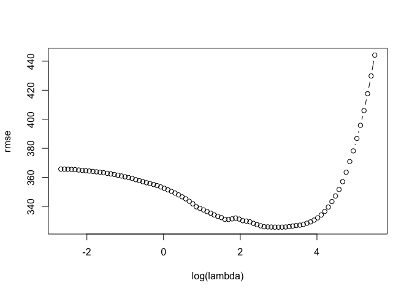

lasso\_ridge
================

This is an [R Markdown](http://rmarkdown.rstudio.com) Notebook. When you execute code within the notebook, the results appear beneath the code.

Try executing this chunk by clicking the *Run* button within the chunk or by placing your cursor inside it and pressing *Cmd+Shift+Enter*.

``` r
# ridge regression and lasso
library(glmnet)
```

    ## Loading required package: Matrix

    ## Loading required package: foreach

    ## Loaded glmnet 2.0-5

``` r
library(ISLR)
library(leaps)
```

``` r
# omitting na values
Hitters=na.omit(Hitters)
# checking if all na's have been removed
with(Hitters,sum(is.na(Salary)))
```

    ## [1] 0

``` r
x=model.matrix(Salary~.-1,data=Hitters)
y=Hitters$Salary

# alpha=0 is ridge and alpha=1 is lasso
ridge=glmnet(x,y,alpha=0)
plot(ridge,xvar="lambda",label=TRUE)
```


``` r
# with cross validation
cv.ridge=cv.glmnet(x,y,alpha=0)
plot(cv.ridge)
```


``` r
#### lasso regression, alpha=1
lasso=glmnet(x,y)
plot(lasso, xvar="lambda",label=TRUE)
```


``` r
plot(lasso, xvar="dev",label=TRUE)
```


``` r
# with cross-validation
cv.lasso=cv.glmnet(x,y)
plot(cv.lasso)
```


``` r
coef(cv.lasso)
```

    ## 21 x 1 sparse Matrix of class "dgCMatrix"
    ##                        1
    ## (Intercept) 2.220974e+02
    ## AtBat       .           
    ## Hits        1.129009e+00
    ## HmRun       .           
    ## Runs        .           
    ## RBI         .           
    ## Walks       1.172062e+00
    ## Years       .           
    ## CAtBat      .           
    ## CHits       .           
    ## CHmRun      .           
    ## CRuns       1.147170e-01
    ## CRBI        3.085475e-01
    ## CWalks      .           
    ## LeagueA     .           
    ## LeagueN     .           
    ## DivisionW   .           
    ## PutOuts     1.763115e-03
    ## Assists     .           
    ## Errors      .           
    ## NewLeagueN  .

``` r
## if we want to select lambda using train/ validation approach
set.seed(1)
train=sample(seq(263),180,replace=FALSE)
train
```

    ##   [1]  70  98 150 237  53 232 243 170 161  16 259  45 173  97 192 124 178
    ##  [18] 245  94 190 228  52 158  31  64  92   4  91 205  80 113 140 115  43
    ##  [35] 244 153 181  25 163  93 184 144 174 122 117 251   6 104 241 149 102
    ##  [52] 183 224 242  15  21  66 107 136  83 186  60 211  67 130 210  95 151
    ##  [69]  17 256 207 162 200 239 236 168 249  73 222 177 234 199 203  59 235
    ##  [86]  37 126  22 230 226  42  11 110 214 132 134  77  69 188 100 206  58
    ## [103]  44 159 101  34 208  75 185 201 261 112  54  65  23   2 106 254 257
    ## [120] 154 142  71 166 221 105  63 143  29 240 212 167 172   5  84 120 133
    ## [137]  72 191 248 138 182  74 179 135  87 196 157 119  13  99 263 125 247
    ## [154]  50  55  20  57   8  30 194 139 238  46  78  88  41   7  33 141  32
    ## [171] 180 164 213  36 215  79 225 229 198  76

``` r
lasso=glmnet(x[train,],y[train])
lasso
```

    ## 
    ## Call:  glmnet(x = x[train, ], y = y[train]) 
    ## 
    ##       Df    %Dev    Lambda
    ##  [1,]  0 0.00000 246.40000
    ##  [2,]  1 0.05013 224.50000
    ##  [3,]  1 0.09175 204.60000
    ##  [4,]  2 0.13840 186.40000
    ##  [5,]  2 0.18000 169.80000
    ##  [6,]  3 0.21570 154.80000
    ##  [7,]  3 0.24710 141.00000
    ##  [8,]  3 0.27320 128.50000
    ##  [9,]  4 0.30010 117.10000
    ## [10,]  4 0.32360 106.70000
    ## [11,]  4 0.34310  97.19000
    ## [12,]  4 0.35920  88.56000
    ## [13,]  5 0.37360  80.69000
    ## [14,]  5 0.38900  73.52000
    ## [15,]  5 0.40190  66.99000
    ## [16,]  5 0.41260  61.04000
    ## [17,]  5 0.42140  55.62000
    ## [18,]  5 0.42880  50.67000
    ## [19,]  5 0.43490  46.17000
    ## [20,]  5 0.43990  42.07000
    ## [21,]  5 0.44410  38.33000
    ## [22,]  5 0.44760  34.93000
    ## [23,]  6 0.45140  31.83000
    ## [24,]  7 0.45480  29.00000
    ## [25,]  7 0.45770  26.42000
    ## [26,]  7 0.46010  24.07000
    ## [27,]  8 0.46220  21.94000
    ## [28,]  8 0.46380  19.99000
    ## [29,]  8 0.46520  18.21000
    ## [30,]  8 0.46630  16.59000
    ## [31,]  8 0.46730  15.12000
    ## [32,]  8 0.46810  13.78000
    ## [33,]  9 0.47110  12.55000
    ## [34,]  9 0.47380  11.44000
    ## [35,]  9 0.47620  10.42000
    ## [36,] 10 0.48050   9.49500
    ## [37,]  9 0.48450   8.65200
    ## [38,] 10 0.48770   7.88300
    ## [39,] 10 0.49360   7.18300
    ## [40,] 11 0.49890   6.54500
    ## [41,] 12 0.50450   5.96300
    ## [42,] 12 0.51010   5.43400
    ## [43,] 13 0.51470   4.95100
    ## [44,] 13 0.51850   4.51100
    ## [45,] 13 0.52170   4.11000
    ## [46,] 14 0.52440   3.74500
    ## [47,] 14 0.52670   3.41200
    ## [48,] 15 0.52870   3.10900
    ## [49,] 15 0.53030   2.83300
    ## [50,] 15 0.53160   2.58100
    ## [51,] 16 0.53280   2.35200
    ## [52,] 17 0.53420   2.14300
    ## [53,] 18 0.53580   1.95300
    ## [54,] 18 0.53760   1.77900
    ## [55,] 18 0.53890   1.62100
    ## [56,] 18 0.54000   1.47700
    ## [57,] 18 0.54090   1.34600
    ## [58,] 18 0.54160   1.22600
    ## [59,] 18 0.54220   1.11700
    ## [60,] 18 0.54280   1.01800
    ## [61,] 18 0.54320   0.92770
    ## [62,] 18 0.54360   0.84530
    ## [63,] 18 0.54380   0.77020
    ## [64,] 19 0.54410   0.70180
    ## [65,] 19 0.54430   0.63940
    ## [66,] 19 0.54450   0.58260
    ## [67,] 19 0.54470   0.53090
    ## [68,] 19 0.54490   0.48370
    ## [69,] 20 0.54510   0.44070
    ## [70,] 20 0.54520   0.40160
    ## [71,] 20 0.54530   0.36590
    ## [72,] 20 0.54540   0.33340
    ## [73,] 20 0.54550   0.30380
    ## [74,] 20 0.54560   0.27680
    ## [75,] 20 0.54570   0.25220
    ## [76,] 20 0.54570   0.22980
    ## [77,] 20 0.54580   0.20940
    ## [78,] 20 0.54580   0.19080
    ## [79,] 20 0.54590   0.17380
    ## [80,] 20 0.54590   0.15840
    ## [81,] 20 0.54590   0.14430
    ## [82,] 20 0.54590   0.13150
    ## [83,] 20 0.54600   0.11980
    ## [84,] 19 0.54600   0.10920
    ## [85,] 19 0.54600   0.09948
    ## [86,] 19 0.54600   0.09064
    ## [87,] 19 0.54600   0.08259
    ## [88,] 20 0.54600   0.07525
    ## [89,] 20 0.54600   0.06856

``` r
prediction=predict(lasso,x[-train,])
dim(prediction)
```

    ## [1] 83 89

``` r
rmse=sqrt(apply((y[-train]-prediction)^2,2,mean))
plot(log(lasso$lambda),rmse,type="b",xlab="log(lambda)")
```



``` r
lam.best=lasso$lambda[order(rmse)[1]]
lam.best
```

    ## [1] 19.98706

``` r
coef(lasso,s=lam.best)
```

    ## 21 x 1 sparse Matrix of class "dgCMatrix"
    ##                        1
    ## (Intercept)  107.9416686
    ## AtBat          .        
    ## Hits           0.1591252
    ## HmRun          .        
    ## Runs           .        
    ## RBI            1.7340039
    ## Walks          3.4657091
    ## Years          .        
    ## CAtBat         .        
    ## CHits          .        
    ## CHmRun         .        
    ## CRuns          0.5386855
    ## CRBI           .        
    ## CWalks         .        
    ## LeagueA      -30.0493021
    ## LeagueN        .        
    ## DivisionW   -113.8317016
    ## PutOuts        0.2915409
    ## Assists        .        
    ## Errors         .        
    ## NewLeagueN     2.0367518

Add a new chunk by clicking the *Insert Chunk* button on the toolbar or by pressing *Cmd+Option+I*.

When you save the notebook, an HTML file containing the code and output will be saved alongside it (click the *Preview* button or press *Cmd+Shift+K* to preview the HTML file).
