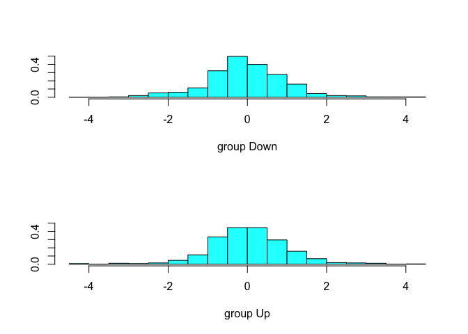

linear discriminant analysis
================

This is an [R Markdown](http://rmarkdown.rstudio.com) Notebook. When you execute code within the notebook, the results appear beneath the code.

Try executing this chunk by clicking the *Run* button within the chunk or by placing your cursor inside it and pressing *Cmd+Shift+Enter*.

``` r
require(ISLR)
```

    ## Loading required package: ISLR

``` r
require(MASS)
```

    ## Loading required package: MASS

``` r
#linear discriminant analysis
model=lda(Direction~Lag1+Lag2, data=Smarket, subset=Year<2005)
model
```

    ## Call:
    ## lda(Direction ~ Lag1 + Lag2, data = Smarket, subset = Year < 
    ##     2005)
    ## 
    ## Prior probabilities of groups:
    ##     Down       Up 
    ## 0.491984 0.508016 
    ## 
    ## Group means:
    ##             Lag1        Lag2
    ## Down  0.04279022  0.03389409
    ## Up   -0.03954635 -0.03132544
    ## 
    ## Coefficients of linear discriminants:
    ##             LD1
    ## Lag1 -0.6420190
    ## Lag2 -0.5135293

``` r
plot(model)
```



``` r
#test data
Smarket.2005=subset(Smarket,Year==2005)

prediction=predict(model,Smarket.2005)
class(prediction)
```

    ## [1] "list"

``` r
# convenient way of looking the list is through data frame
data.frame(prediction)[1:5,]
```

    ##      class posterior.Down posterior.Up         LD1
    ## 999     Up      0.4901792    0.5098208  0.08293096
    ## 1000    Up      0.4792185    0.5207815  0.59114102
    ## 1001    Up      0.4668185    0.5331815  1.16723063
    ## 1002    Up      0.4740011    0.5259989  0.83335022
    ## 1003    Up      0.4927877    0.5072123 -0.03792892

``` r
# confusion matrix
table(prediction$class,Smarket.2005$Direction)
```

    ##       
    ##        Down  Up
    ##   Down   35  35
    ##   Up     76 106

``` r
# correct mean
mean(prediction$class==Smarket.2005$Direction)
```

    ## [1] 0.5595238

Add a new chunk by clicking the *Insert Chunk* button on the toolbar or by pressing *Cmd+Option+I*.

When you save the notebook, an HTML file containing the code and output will be saved alongside it (click the *Preview* button or press *Cmd+Shift+K* to preview the HTML file).
