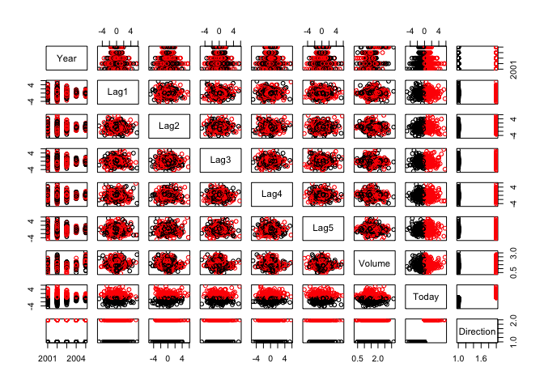

linear\_reg
================

This is an [R Markdown](http://rmarkdown.rstudio.com) Notebook. When you execute code within the notebook, the results appear beneath the code.

Try executing this chunk by clicking the *Run* button within the chunk or by placing your cursor inside it and pressing *Cmd+Shift+Enter*.

``` r
require(ISLR) # similar to library
```

    ## Loading required package: ISLR

``` r
names(Smarket)
```

    ## [1] "Year"      "Lag1"      "Lag2"      "Lag3"      "Lag4"      "Lag5"     
    ## [7] "Volume"    "Today"     "Direction"

``` r
# predicting direction -- binary response
```

``` r
# plotting all variables
pairs(Smarket,col=Smarket$Direction)
```



``` r
#logistic regression
model=glm(Direction~Lag1+Lag2+Lag3+Lag4+Lag5+Volume,
          data=Smarket, family=binomial)

summary(model)
```

    ## 
    ## Call:
    ## glm(formula = Direction ~ Lag1 + Lag2 + Lag3 + Lag4 + Lag5 + 
    ##     Volume, family = binomial, data = Smarket)
    ## 
    ## Deviance Residuals: 
    ##    Min      1Q  Median      3Q     Max  
    ## -1.446  -1.203   1.065   1.145   1.326  
    ## 
    ## Coefficients:
    ##              Estimate Std. Error z value Pr(>|z|)
    ## (Intercept) -0.126000   0.240736  -0.523    0.601
    ## Lag1        -0.073074   0.050167  -1.457    0.145
    ## Lag2        -0.042301   0.050086  -0.845    0.398
    ## Lag3         0.011085   0.049939   0.222    0.824
    ## Lag4         0.009359   0.049974   0.187    0.851
    ## Lag5         0.010313   0.049511   0.208    0.835
    ## Volume       0.135441   0.158360   0.855    0.392
    ## 
    ## (Dispersion parameter for binomial family taken to be 1)
    ## 
    ##     Null deviance: 1731.2  on 1249  degrees of freedom
    ## Residual deviance: 1727.6  on 1243  degrees of freedom
    ## AIC: 1741.6
    ## 
    ## Number of Fisher Scoring iterations: 3

``` r
prediction=predict(model,type="response")
prediction[1:10]
```

    ##         1         2         3         4         5         6         7 
    ## 0.5070841 0.4814679 0.4811388 0.5152224 0.5107812 0.5069565 0.4926509 
    ##         8         9        10 
    ## 0.5092292 0.5176135 0.4888378

``` r
final_predictions=ifelse(prediction>0.5,"Up","Down")

attach(Smarket)

# table of training prediction
table(final_predictions,Direction)
```

    ##                  Direction
    ## final_predictions Down  Up
    ##              Down  145 141
    ##              Up    457 507

``` r
mean(final_predictions==Direction)
```

    ## [1] 0.5216

``` r
###### training and test set
train=Year<2005
model2=glm(Direction~Lag1+Lag2+Lag3+Lag4+Lag5+Volume,
          data=Smarket, family=binomial, subset=train)

summary(model2)
```

    ## 
    ## Call:
    ## glm(formula = Direction ~ Lag1 + Lag2 + Lag3 + Lag4 + Lag5 + 
    ##     Volume, family = binomial, data = Smarket, subset = train)
    ## 
    ## Deviance Residuals: 
    ##    Min      1Q  Median      3Q     Max  
    ## -1.302  -1.190   1.079   1.160   1.350  
    ## 
    ## Coefficients:
    ##              Estimate Std. Error z value Pr(>|z|)
    ## (Intercept)  0.191213   0.333690   0.573    0.567
    ## Lag1        -0.054178   0.051785  -1.046    0.295
    ## Lag2        -0.045805   0.051797  -0.884    0.377
    ## Lag3         0.007200   0.051644   0.139    0.889
    ## Lag4         0.006441   0.051706   0.125    0.901
    ## Lag5        -0.004223   0.051138  -0.083    0.934
    ## Volume      -0.116257   0.239618  -0.485    0.628
    ## 
    ## (Dispersion parameter for binomial family taken to be 1)
    ## 
    ##     Null deviance: 1383.3  on 997  degrees of freedom
    ## Residual deviance: 1381.1  on 991  degrees of freedom
    ## AIC: 1395.1
    ## 
    ## Number of Fisher Scoring iterations: 3

``` r
prediction2=predict(model2,newdata=Smarket[!train,], type="response")
prediction2[1:10]
```

    ##       999      1000      1001      1002      1003      1004      1005 
    ## 0.5282195 0.5156688 0.5226521 0.5138543 0.4983345 0.5010912 0.5027703 
    ##      1006      1007      1008 
    ## 0.5095680 0.5040112 0.5106408

``` r
final_predictions2=ifelse(prediction2>0.5,"Up","Down")
Direction.2005=Smarket$Direction[!train]

# table of training prediction
table(final_predictions2,Direction.2005)
```

    ##                   Direction.2005
    ## final_predictions2 Down Up
    ##               Down   77 97
    ##               Up     34 44

``` r
mean(final_predictions2==Direction.2005)
```

    ## [1] 0.4801587

``` r
## output shows we are overfitting
```

``` r
# lets use a smaller model
model3=glm(Direction~Lag1+Lag2,
           data=Smarket, family=binomial, subset=train)

summary(model3)
```

    ## 
    ## Call:
    ## glm(formula = Direction ~ Lag1 + Lag2, family = binomial, data = Smarket, 
    ##     subset = train)
    ## 
    ## Deviance Residuals: 
    ##    Min      1Q  Median      3Q     Max  
    ## -1.345  -1.188   1.074   1.164   1.326  
    ## 
    ## Coefficients:
    ##             Estimate Std. Error z value Pr(>|z|)
    ## (Intercept)  0.03222    0.06338   0.508    0.611
    ## Lag1        -0.05562    0.05171  -1.076    0.282
    ## Lag2        -0.04449    0.05166  -0.861    0.389
    ## 
    ## (Dispersion parameter for binomial family taken to be 1)
    ## 
    ##     Null deviance: 1383.3  on 997  degrees of freedom
    ## Residual deviance: 1381.4  on 995  degrees of freedom
    ## AIC: 1387.4
    ## 
    ## Number of Fisher Scoring iterations: 3

``` r
prediction3=predict(model3,newdata=Smarket[!train,], type="response")
prediction3[1:10]
```

    ##       999      1000      1001      1002      1003      1004      1005 
    ## 0.5098275 0.5208237 0.5332635 0.5260574 0.5072103 0.5061388 0.5048890 
    ##      1006      1007      1008 
    ## 0.5127302 0.5093032 0.5156231

``` r
final_predictions3=ifelse(prediction3>0.5,"Up","Down")

# table of training prediction
table(final_predictions3,Direction.2005)
```

    ##                   Direction.2005
    ## final_predictions3 Down  Up
    ##               Down   35  35
    ##               Up     76 106

``` r
mean(final_predictions3==Direction.2005)
```

    ## [1] 0.5595238

``` r
# mean increased with a smaller model
```

Add a new chunk by clicking the *Insert Chunk* button on the toolbar or by pressing *Cmd+Option+I*.

When you save the notebook, an HTML file containing the code and output will be saved alongside it (click the *Preview* button or press *Cmd+Shift+K* to preview the HTML file).
