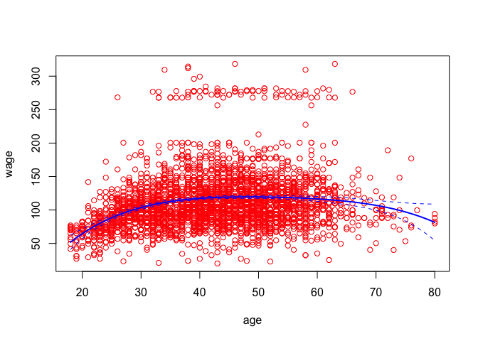
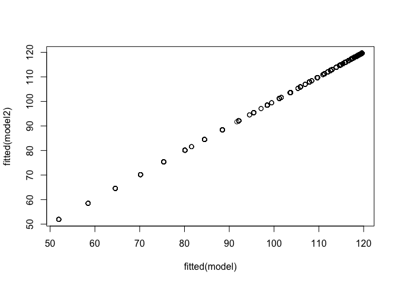
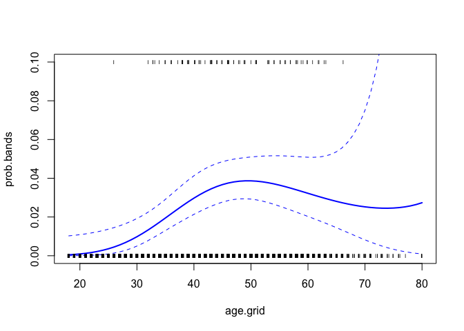

non\_linear\_regression
================

This is an [R Markdown](http://rmarkdown.rstudio.com) Notebook. When you execute code within the notebook, the results appear beneath the code.

Try executing this chunk by clicking the *Run* button within the chunk or by placing your cursor inside it and pressing *Cmd+Shift+Enter*.

``` r
# non linear models

require(ISLR)
```

    ## Loading required package: ISLR

``` r
attach(Wage)

# polynomial regression
model=lm(wage~poly(age,4),data=Wage)
summary(model)
```

    ## 
    ## Call:
    ## lm(formula = wage ~ poly(age, 4), data = Wage)
    ## 
    ## Residuals:
    ##     Min      1Q  Median      3Q     Max 
    ## -98.707 -24.626  -4.993  15.217 203.693 
    ## 
    ## Coefficients:
    ##                Estimate Std. Error t value Pr(>|t|)    
    ## (Intercept)    111.7036     0.7287 153.283  < 2e-16 ***
    ## poly(age, 4)1  447.0679    39.9148  11.201  < 2e-16 ***
    ## poly(age, 4)2 -478.3158    39.9148 -11.983  < 2e-16 ***
    ## poly(age, 4)3  125.5217    39.9148   3.145  0.00168 ** 
    ## poly(age, 4)4  -77.9112    39.9148  -1.952  0.05104 .  
    ## ---
    ## Signif. codes:  0 '***' 0.001 '**' 0.01 '*' 0.05 '.' 0.1 ' ' 1
    ## 
    ## Residual standard error: 39.91 on 2995 degrees of freedom
    ## Multiple R-squared:  0.08626,    Adjusted R-squared:  0.08504 
    ## F-statistic: 70.69 on 4 and 2995 DF,  p-value: < 2.2e-16

``` r
# plot of fitted function
agelims=range(age)
age.grid=seq(from=agelims[1],to=agelims[2])
prediction=predict(model,newdata=list(age=age.grid),se=TRUE)
se.bands=cbind(prediction$fit+2*prediction$se,prediction$fit-2*prediction$se)
plot(age,wage,col="red")
lines(age.grid,prediction$fit,lwd=2,col="blue")
matlines(age.grid,se.bands,col="blue",lty=2)
```



``` r
# alternative way
model2=lm(wage~age+I(age^2)+I(age^3)+I(age^4),data=Wage)
summary(model2)
```

    ## 
    ## Call:
    ## lm(formula = wage ~ age + I(age^2) + I(age^3) + I(age^4), data = Wage)
    ## 
    ## Residuals:
    ##     Min      1Q  Median      3Q     Max 
    ## -98.707 -24.626  -4.993  15.217 203.693 
    ## 
    ## Coefficients:
    ##               Estimate Std. Error t value Pr(>|t|)    
    ## (Intercept) -1.842e+02  6.004e+01  -3.067 0.002180 ** 
    ## age          2.125e+01  5.887e+00   3.609 0.000312 ***
    ## I(age^2)    -5.639e-01  2.061e-01  -2.736 0.006261 ** 
    ## I(age^3)     6.811e-03  3.066e-03   2.221 0.026398 *  
    ## I(age^4)    -3.204e-05  1.641e-05  -1.952 0.051039 .  
    ## ---
    ## Signif. codes:  0 '***' 0.001 '**' 0.01 '*' 0.05 '.' 0.1 ' ' 1
    ## 
    ## Residual standard error: 39.91 on 2995 degrees of freedom
    ## Multiple R-squared:  0.08626,    Adjusted R-squared:  0.08504 
    ## F-statistic: 70.69 on 4 and 2995 DF,  p-value: < 2.2e-16

``` r
# the plot shows both are fitted models are same as the plot is along the diagonal
plot(fitted(model),fitted(model2))
```



``` r
# using anova function to test nested sequence of models
fita=lm(wage~education,data=Wage)
fitb=lm(wage~education+age,data=Wage)
fitc=lm(wage~education+poly(age,2),data=Wage)
fitd=lm(wage~education+poly(age,3),data=Wage)
anova(fita,fitb,fitc,fitd)
```

    ## Analysis of Variance Table
    ## 
    ## Model 1: wage ~ education
    ## Model 2: wage ~ education + age
    ## Model 3: wage ~ education + poly(age, 2)
    ## Model 4: wage ~ education + poly(age, 3)
    ##   Res.Df     RSS Df Sum of Sq        F Pr(>F)    
    ## 1   2995 3995721                                 
    ## 2   2994 3867992  1    127729 102.7378 <2e-16 ***
    ## 3   2993 3725395  1    142597 114.6969 <2e-16 ***
    ## 4   2992 3719809  1      5587   4.4936 0.0341 *  
    ## ---
    ## Signif. codes:  0 '***' 0.001 '**' 0.01 '*' 0.05 '.' 0.1 ' ' 1

``` r
## polynomial logistic regression
fit=glm(I(wage>250)~poly(age,3),data=Wage, family=binomial)
summary(fit)
```

    ## 
    ## Call:
    ## glm(formula = I(wage > 250) ~ poly(age, 3), family = binomial, 
    ##     data = Wage)
    ## 
    ## Deviance Residuals: 
    ##     Min       1Q   Median       3Q      Max  
    ## -0.2808  -0.2736  -0.2487  -0.1758   3.2868  
    ## 
    ## Coefficients:
    ##               Estimate Std. Error z value Pr(>|z|)    
    ## (Intercept)    -3.8486     0.1597 -24.100  < 2e-16 ***
    ## poly(age, 3)1  37.8846    11.4818   3.300 0.000968 ***
    ## poly(age, 3)2 -29.5129    10.5626  -2.794 0.005205 ** 
    ## poly(age, 3)3   9.7966     8.9990   1.089 0.276317    
    ## ---
    ## Signif. codes:  0 '***' 0.001 '**' 0.01 '*' 0.05 '.' 0.1 ' ' 1
    ## 
    ## (Dispersion parameter for binomial family taken to be 1)
    ## 
    ##     Null deviance: 730.53  on 2999  degrees of freedom
    ## Residual deviance: 707.92  on 2996  degrees of freedom
    ## AIC: 715.92
    ## 
    ## Number of Fisher Scoring iterations: 8

``` r
prediction=predict(fit,list(age=age.grid),se=T)
se.bands=prediction$fit+cbind(fit=0,lower=-2*prediction$se,upper=2*prediction$se)
se.bands[1:5,]
```

    ##         fit      lower     upper
    ## 1 -7.664756 -10.759826 -4.569686
    ## 2 -7.324776 -10.106699 -4.542852
    ## 3 -7.001732  -9.492821 -4.510643
    ## 4 -6.695229  -8.917158 -4.473300
    ## 5 -6.404868  -8.378691 -4.431045

``` r
# we have done the computations on the logit scale. To transform to probabilities we need to inverse the logit mapping
prob.bands=exp(se.bands)/(1+exp(se.bands))
matplot(age.grid,prob.bands,col="blue",lwd=c(2,1,1),lty=c(1,2,2),type="l",ylim=c(0,.1))
points(jitter(age),I(wage>250)/10,pch="I",cex=0.5)
```



Add a new chunk by clicking the *Insert Chunk* button on the toolbar or by pressing *Cmd+Option+I*.

When you save the notebook, an HTML file containing the code and output will be saved alongside it (click the *Preview* button or press *Cmd+Shift+K* to preview the HTML file).
