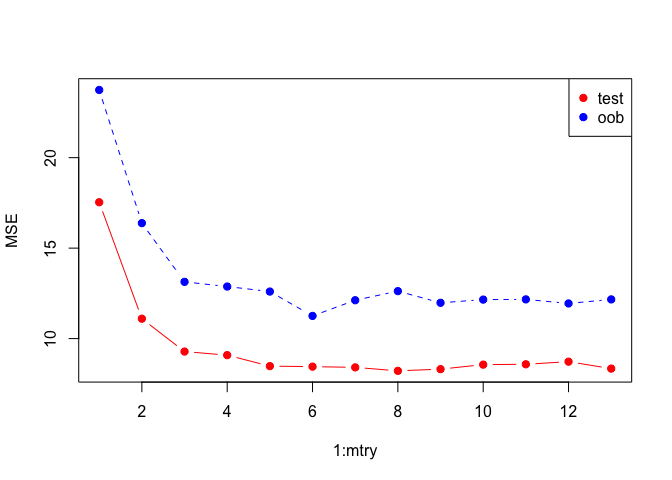
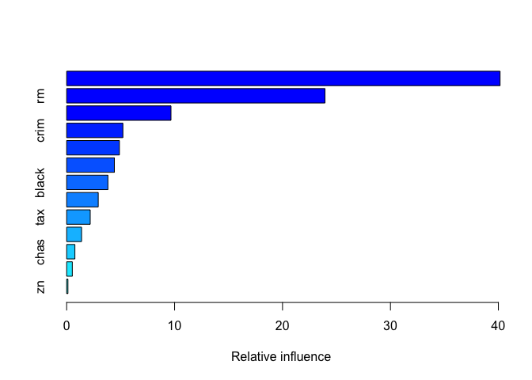
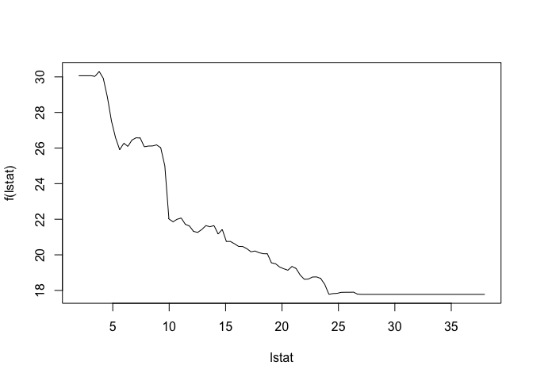
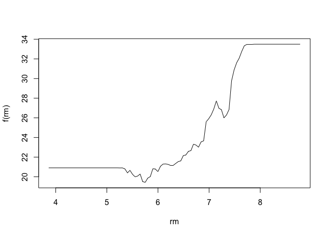
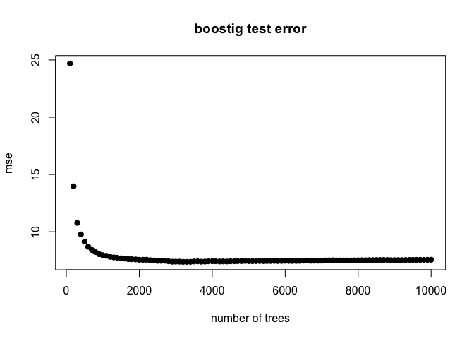

randomforest\_boosting
================

This is an [R Markdown](http://rmarkdown.rstudio.com) Notebook. When you execute code within the notebook, the results appear beneath the code.

Try executing this chunk by clicking the *Run* button within the chunk or by placing your cursor inside it and pressing *Cmd+Shift+Enter*.

``` r
require(randomForest)
```

    ## Loading required package: randomForest

    ## randomForest 4.6-12

    ## Type rfNews() to see new features/changes/bug fixes.

``` r
require(MASS)
```

    ## Loading required package: MASS

``` r
set.seed(7)
dim(Boston)
```

    ## [1] 506  14

``` r
train=sample(1:nrow(Boston),300)

model=randomForest(medv~.,data=Boston,subset = train)
model
```

    ## 
    ## Call:
    ##  randomForest(formula = medv ~ ., data = Boston, subset = train) 
    ##                Type of random forest: regression
    ##                      Number of trees: 500
    ## No. of variables tried at each split: 4
    ## 
    ##           Mean of squared residuals: 13.12365
    ##                     % Var explained: 85.43

``` r
# trying different values of mtry
oob.error=double(13)
test.error=double(13)
for (mtry in 1:13)
{
  model=randomForest(medv~.,data=Boston,subset=train,mtry=mtry,ntree=400)
  oob.error[mtry]=model$mse[400]
  prediction=predict(model,Boston[-train,])
  test.error[mtry]=with(Boston[-train,],mean((medv-prediction)^2))
  cat(mtry,"")
}
```

    ## 1 2 3 4 5 6 7 8 9 10 11 12 13

``` r
matplot(1:mtry,cbind(test.error,oob.error),pch=19,col=c("red","blue"),type="b",ylab="MSE")
legend("topright",legend=c("test","oob"),pch=19,col=c("red","blue"))
```



``` r
#########boosting############
require(gbm)
```

    ## Loading required package: gbm

    ## Loading required package: survival

    ## Loading required package: lattice

    ## Loading required package: splines

    ## Loading required package: parallel

    ## Loaded gbm 2.1.3

``` r
model=gbm(medv~.,data=Boston[train,],distribution="gaussian",n.trees=10000,shrinkage=0.01,interaction.depth=4)
summary(model)
```



    ##             var    rel.inf
    ## lstat     lstat 40.1565700
    ## rm           rm 23.9355077
    ## dis         dis  9.6660678
    ## crim       crim  5.2100977
    ## nox         nox  4.8886528
    ## age         age  4.4216284
    ## black     black  3.8204957
    ## ptratio ptratio  2.9274896
    ## tax         tax  2.1844441
    ## indus     indus  1.3825547
    ## chas       chas  0.7640736
    ## rad         rad  0.5235624
    ## zn           zn  0.1188556

``` r
plot(model,i="lstat")
```



``` r
plot(model,i="rm")
```



``` r
# compute test error as a fxn of trees
n.trees=seq(from=100,to=10000,by=100)
prediction=predict(model,newdata=Boston[-train,],n.trees=n.trees)
dim(prediction)
```

    ## [1] 206 100

``` r
error=with(Boston[-train,],apply((prediction-medv)^2,2,mean))
plot(n.trees,error,pch=19,ylab="mse",xlab="number of trees",main="boostig test error")
```



Add a new chunk by clicking the *Insert Chunk* button on the toolbar or by pressing *Cmd+Option+I*.

When you save the notebook, an HTML file containing the code and output will be saved alongside it (click the *Preview* button or press *Cmd+Shift+K* to preview the HTML file).
