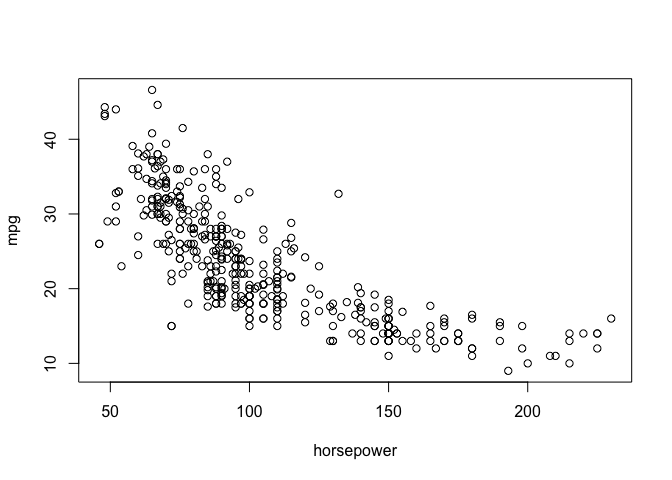
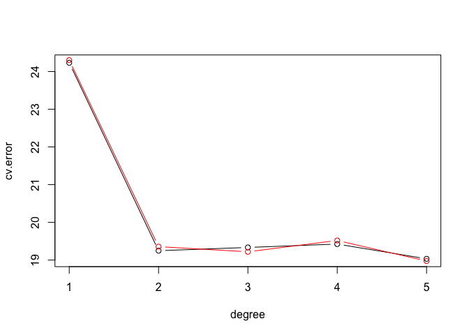
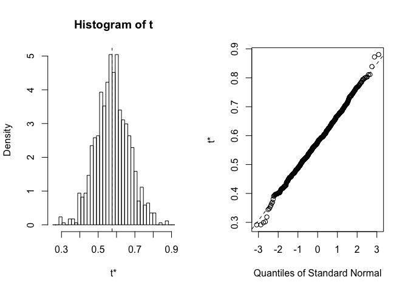

resampling methods
================

This is an [R Markdown](http://rmarkdown.rstudio.com) Notebook. When you execute code within the notebook, the results appear beneath the code.

Try executing this chunk by clicking the *Run* button within the chunk or by placing your cursor inside it and pressing *Cmd+Shift+Enter*.

``` r
# leave one out cross validation
require(ISLR)
```

    ## Loading required package: ISLR

``` r
require(boot)
```

    ## Loading required package: boot

``` r
?cv.glm()
```

``` r
plot(mpg~horsepower,data=Auto)
```



``` r
model=glm(mpg~horsepower, data=Auto)
```

``` r
# delta is crossvalidation prediction error
cv.glm(Auto,model)$delta
```

    ## [1] 24.23151 24.23114

``` r
loocv=function(fit)
{
  h=lm.influence(fit)$h
  mean((residuals(fit)/(1-h))^2)
}

loocv(model)
```

    ## [1] 24.23151

``` r
# trying out different degrees of model
# array of 5 indexes... all 0's
cv.error=rep(0,5)
degree=1:5
for (d in degree)
{
  model=glm(mpg~poly(horsepower,d), data=Auto)
  cv.error[d]=loocv(model)
}
plot(degree,cv.error,type="b")


# 10 fold cross validation
cv.error10=rep(0,5)
for (d in degree)
{
  model=glm(mpg~poly(horsepower,d), data=Auto)
  cv.error10[d]=cv.glm(Auto,model,K=10)$delta[1]
}
lines(degree,cv.error10,type="b",col="red")
```



``` r
### Bootstrap
# min risk investment - section 5.2

alpha=function(x,y)
{
  vx=var(x)
  vy=var(y)
  cxy=cov(x,y)
  (vy-cxy)/(vx+vy-2*cxy) # last computed value is the return value
}

alpha(Portfolio$X,Portfolio$Y)
```

    ## [1] 0.5758321

``` r
# implementing bootstrap
alpha.fn=function(data,index)
{
  with(data[index,],alpha(X,Y)) # using "with" we get X and Y present in data frame at the corresponding index number
}

alpha.fn(Portfolio,1:100)
```

    ## [1] 0.5758321

``` r
# bootstrap involves random sample, therefore use seed for replication
set.seed(7)
# sample selects 100 numbers between 1:100 with replacement
alpha.fn(Portfolio,sample(1:100,100,replace=TRUE))
```

    ## [1] 0.6965248

``` r
# using boot function
boot.out=boot(Portfolio,alpha.fn,R=1000)
boot.out
```

    ## 
    ## ORDINARY NONPARAMETRIC BOOTSTRAP
    ## 
    ## 
    ## Call:
    ## boot(data = Portfolio, statistic = alpha.fn, R = 1000)
    ## 
    ## 
    ## Bootstrap Statistics :
    ##      original     bias    std. error
    ## t1* 0.5758321 0.00196971  0.09027052

``` r
plot(boot.out)
```



Add a new chunk by clicking the *Insert Chunk* button on the toolbar or by pressing *Cmd+Option+I*.

When you save the notebook, an HTML file containing the code and output will be saved alongside it (click the *Preview* button or press *Cmd+Shift+K* to preview the HTML file).
