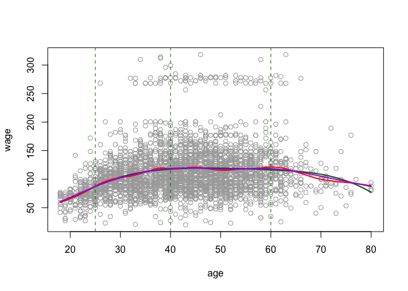
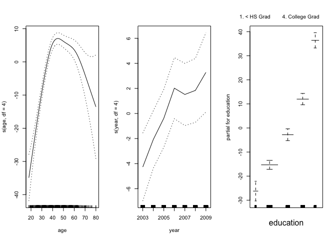
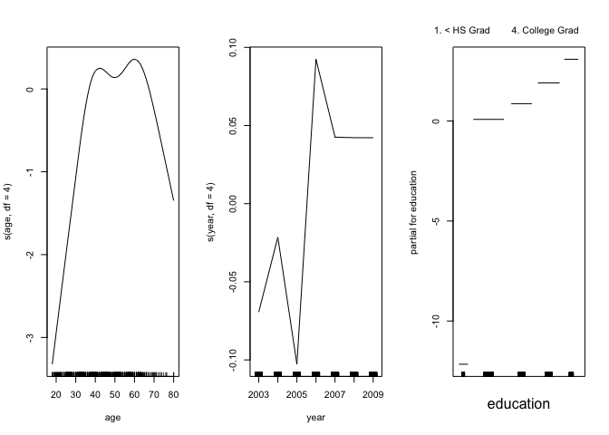
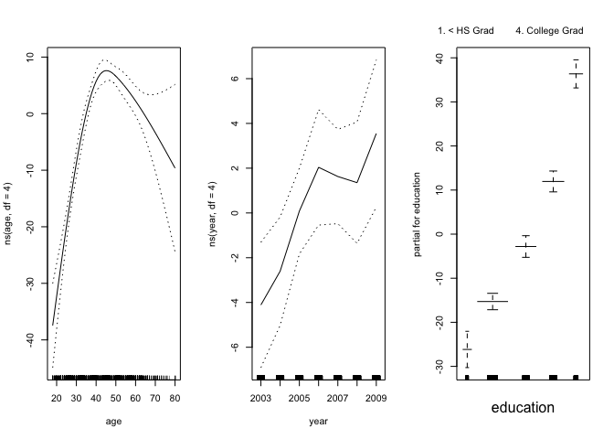

splines\_and\_gam
================

This is an [R Markdown](http://rmarkdown.rstudio.com) Notebook. When you execute code within the notebook, the results appear beneath the code.

Try executing this chunk by clicking the *Run* button within the chunk or by placing your cursor inside it and pressing *Cmd+Shift+Enter*.

``` r
require(splines)
```

    ## Loading required package: splines

``` r
require(ISLR)
```

    ## Loading required package: ISLR

``` r
attach(Wage)

model=lm(wage~bs(age,knots=c(25,40,60)),data=Wage)
plot(age,wage,col="darkgrey")

agelims=range(age)
age.grid=seq(from=agelims[1],to=agelims[2])
lines(age.grid,predict(model,list(age=age.grid)),col="darkgreen",lwd=2)
# plotting knots (place of discontinuity)
abline(v=c(25,40,60),lty=2,col="darkgreen")


# smoothing splines
model=smooth.spline(age,wage,df=16)
lines(model,col="red",lwd=2)

# LOOCV for smoothing parameter
model=smooth.spline(age,wage,cv=TRUE)
```

    ## Warning in smooth.spline(age, wage, cv = TRUE): cross-validation with non-
    ## unique 'x' values seems doubtful

``` r
lines(model,col="purple",lwd=2)
```



``` r
#### generalized additive models
require(gam)
```

    ## Loading required package: gam

    ## Loading required package: foreach

    ## Loaded gam 1.15

``` r
gam1=gam(wage~s(age,df=4)+s(year,df=4)+education,data=Wage)
par(mfrow=c(1,3))
plot(gam1,se=T)
```



``` r
gam2=gam(I(wage>250)~s(age,df=4)+s(year,df=4)+education,data=Wage, family = binomial)
plot(gam2)
```



``` r
### checking whether we need a non linear term for education
gam2a=gam(I(wage>250)~s(age,df=4)+year+education,data=Wage, family = binomial)
anova(gam2a,gam2,test="Chisq")
```

    ## Analysis of Deviance Table
    ## 
    ## Model 1: I(wage > 250) ~ s(age, df = 4) + year + education
    ## Model 2: I(wage > 250) ~ s(age, df = 4) + s(year, df = 4) + education
    ##   Resid. Df Resid. Dev Df Deviance Pr(>Chi)
    ## 1      2990     603.78                     
    ## 2      2987     602.87  3  0.90498   0.8242

``` r
# high p value means we do not need a non linear term for education
```

``` r
par(mfrow=c(1,3))
lm1=lm(wage~ns(age,df=4)+ns(year,df=4)+education,data=Wage)
plot.Gam(lm1,se=T)
```



Add a new chunk by clicking the *Insert Chunk* button on the toolbar or by pressing *Cmd+Option+I*.

When you save the notebook, an HTML file containing the code and output will be saved alongside it (click the *Preview* button or press *Cmd+Shift+K* to preview the HTML file).
