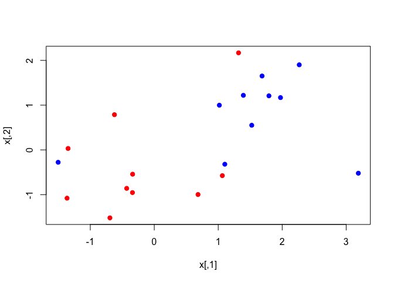
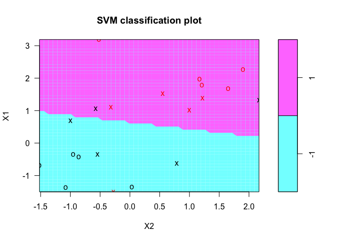
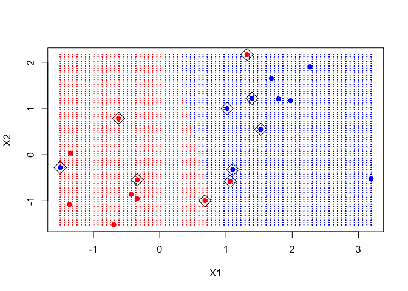

svm\_linear
================

This is an [R Markdown](http://rmarkdown.rstudio.com) Notebook. When you execute code within the notebook, the results appear beneath the code.

Try executing this chunk by clicking the *Run* button within the chunk or by placing your cursor inside it and pressing *Cmd+Shift+Enter*.

``` r
### svm ####

set.seed(1021)
x=matrix(rnorm(40),20,2)
y=rep(c(-1,1),c(10,10))

x[y==1,]=x[y==1,]+1
plot(x,col=y+3,pch=19)
```



``` r
library(e1071)
input=data.frame(x,y=as.factor(y))
model=svm(y~.,data=input,kernel="linear",cost=10,scale=FALSE)
print(model)
```

    ## 
    ## Call:
    ## svm(formula = y ~ ., data = input, kernel = "linear", cost = 10, 
    ##     scale = FALSE)
    ## 
    ## 
    ## Parameters:
    ##    SVM-Type:  C-classification 
    ##  SVM-Kernel:  linear 
    ##        cost:  10 
    ##       gamma:  0.5 
    ## 
    ## Number of Support Vectors:  10

``` r
plot(model,input)
```



``` r
# making a better plot
make.grid=function(x,n=75)
{
  gridrange=apply(x,2,range)
  x1=seq(from=gridrange[1,1],to=gridrange[2,1],length=n)
  x2=seq(from=gridrange[1,2],to=gridrange[2,2],length=n)
  expand.grid(X1=x1,X2=x2)
}

xgrid=make.grid(x)
ygrid=predict(model,xgrid)
plot(xgrid,col=c("red","blue")[as.numeric(ygrid)],pch=19,cex=0.1)
points(x,col=y+3,pch=19)
#support vectors
points(x[model$index,],pch=5,cex=2)
```



Add a new chunk by clicking the *Insert Chunk* button on the toolbar or by pressing *Cmd+Option+I*.

When you save the notebook, an HTML file containing the code and output will be saved alongside it (click the *Preview* button or press *Cmd+Shift+K* to preview the HTML file).
